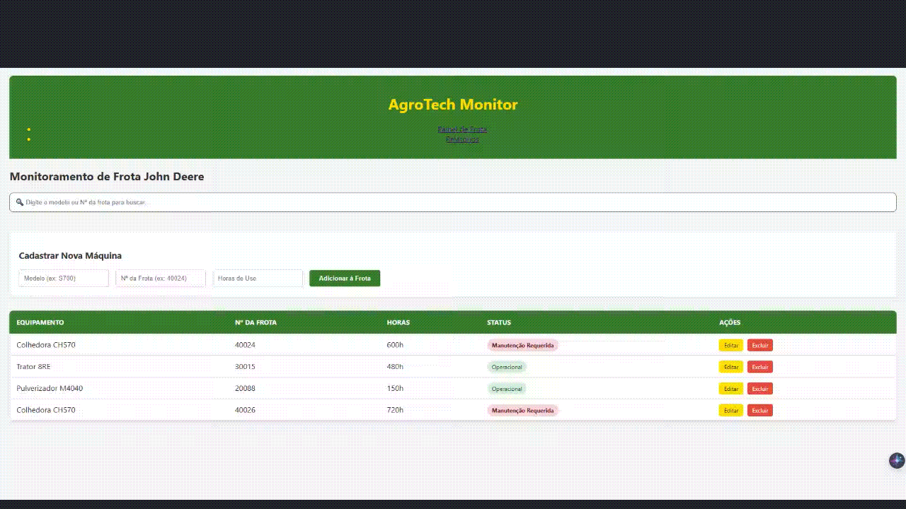

# 🚜 AgroTech System - Fleet Management

Sistema de monitoramento e Business Intelligence (BI) para frotas agrícolas, focado em máquinas de alta tecnologia John Deere.

## 📺 Demonstração do Sistema

## 🛠️ Tecnologias Utilizadas

- **Python 3.9** (Backend)
- **Flask** (Framework Web)
- **SQLite** (Banco de Dados Relacional - Persistência Offline)
- **JavaScript** (Filtros de busca em tempo real)
- **HTML5/CSS3** (Interface Responsiva)

## 🚀 Funcionalidades Principais

- **Gerenciamento de Frota**: CRUD completo (Cadastrar, Ler, Editar e Excluir) de equipamentos.
- **Inteligência de Manutenção**: Cálculo automático de status (Operacional/Alerta) baseado em horas de uso.
- **Painel de BI**: Relatórios em tempo real de disponibilidade de frota e métricas de performance.
- **Busca Otimizada**: Filtro dinâmico por modelo ou número da frota para agilidade operacional.
